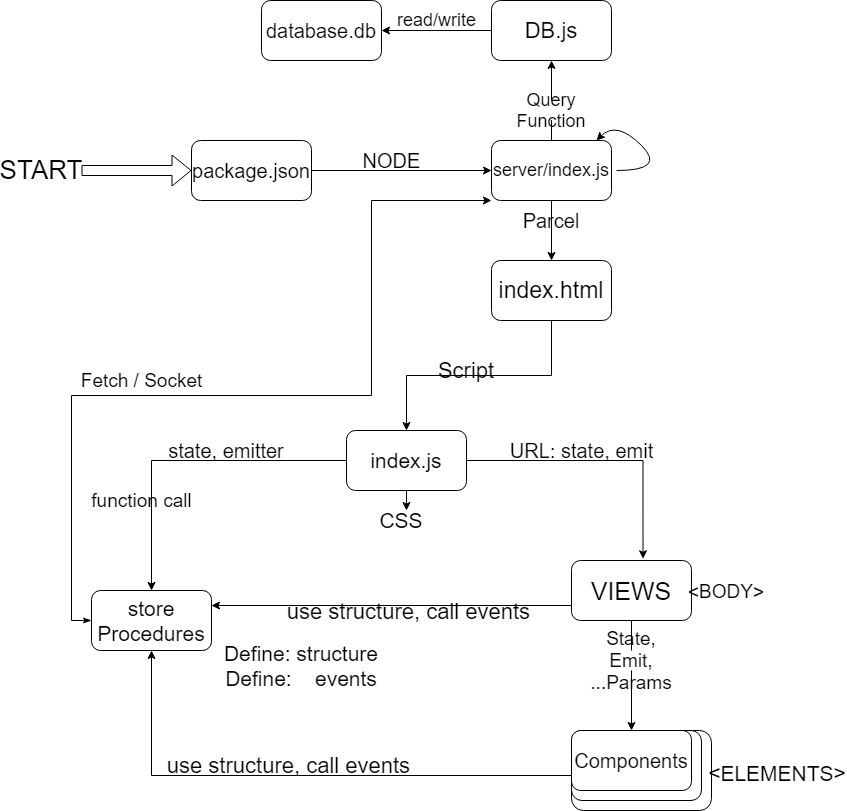

# Basic Web Template

### Inital Setup
```bash
npm i
```

### Generate SSL certs
```bash
certbot certonly --standalone
```


### Get started

```bash
# Developing (nodemon)
npm test

# Single run
npm start
```


